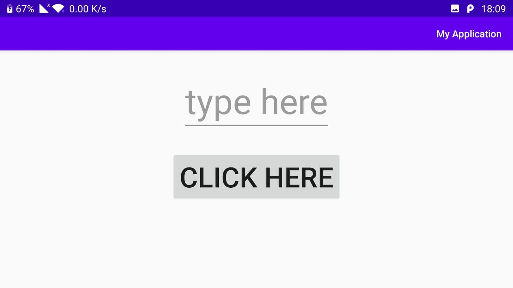

# PostPc_ex1
the program is ex1 for the course 67625 POST PC COMPUTING.  
the program contains 3 components : 
editview for the user to type a text, then the user can push the button and that text moves to a textview 
kamal-"I pledge the highest level of ethical principles in support of academic excellence. 
I ensure that all of my work reflects my own abilities and not those of someone else." 

Screen Shots:

